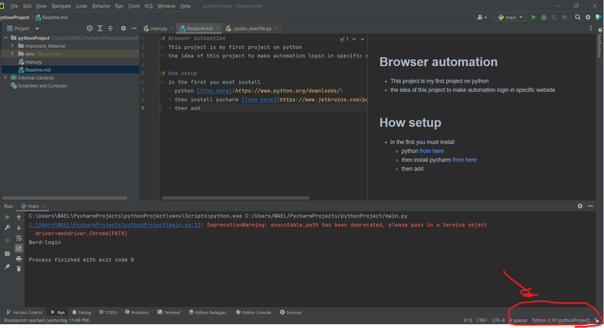
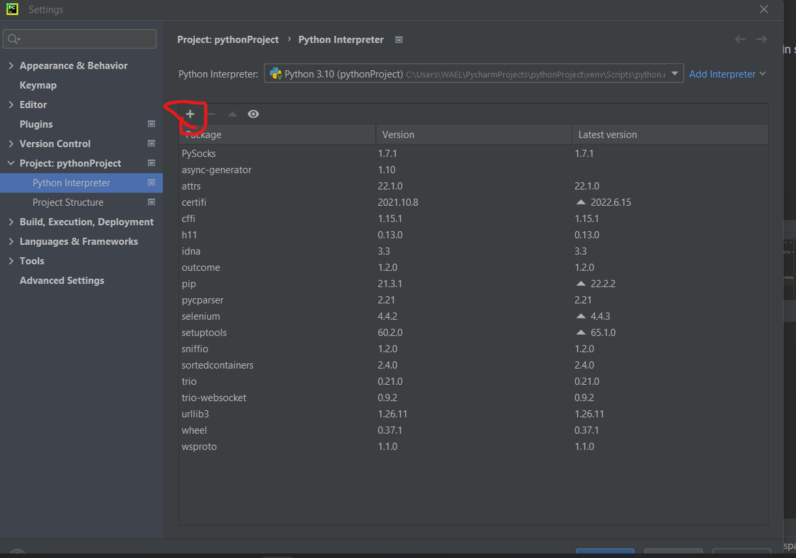
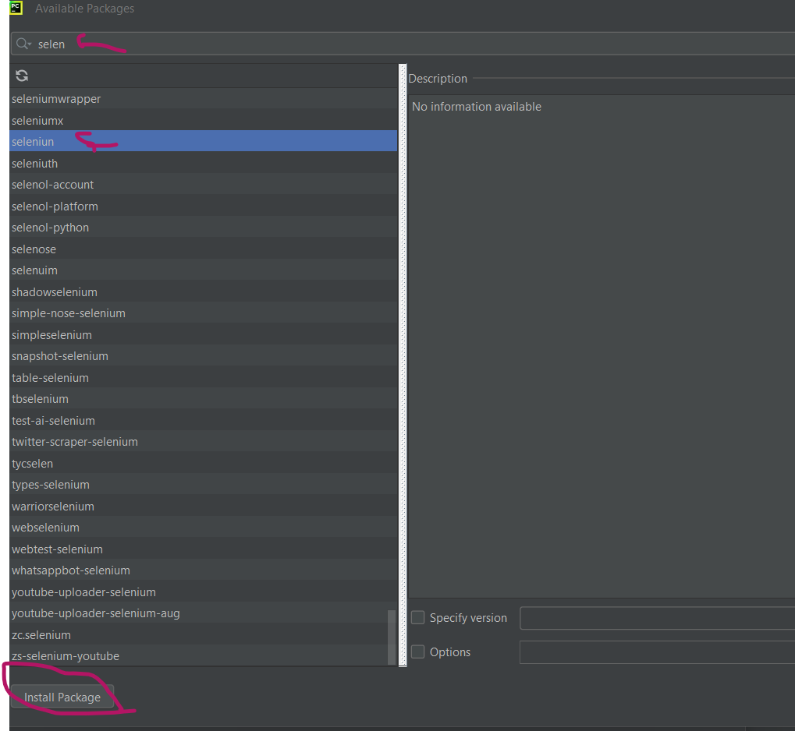

# Browser automation
- This project is my first project on python
- the idea of this project to make automation login in specific website

# How setup
- in the first you must install 
  - python [from here](https://www.python.org/downloads/)
  - then install pycharm [from here](https://www.jetbrains.com/pycharm/download/)
  - then add interpreter
    - 
    - select interpreter setting
    - 
    - 
  - in cmd put this command
    - >pip install selenium
  - then upzip the driver in any directory you want and put the path of it in the var __path__
  - install google chrom 